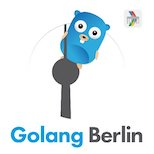

# Berlin DevFest Go Workshop

Code created during Berlin DevFest Workshop.

## What we built

We build a very simple Google App Engine API that let you put and get comments. It is running live at http://devfestcommentsapp.appspot.com/comments

You can see the comments by visiting https://devfestcommentsapp.appspot.com/static/index.html

## How to use it

To post a comment:

```
POST http://devfestcommentsapp.appspot.com/comments
{
  "body": "Lovely comment",
  "author": "Your name",
  "tags: ["tag1","tag2","tag3"]
}
```

The `id` and `ctime` fields will be set by the server.

To get a list of the recent comments:

```
GET http://devfestcommentsapp.appspot.com/comments
```
